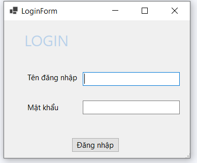
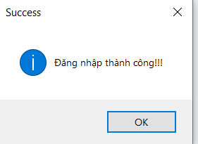
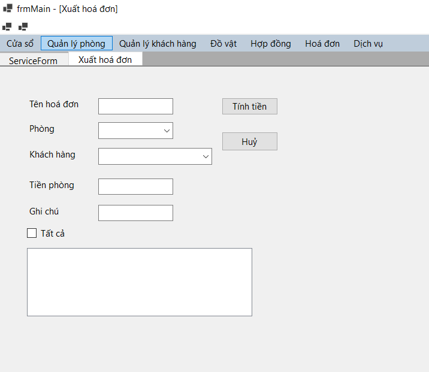


**Group Project Documentation 
Basic Cross-Platform Application Programming with .NET** 

***Hostel Management System***

**Prepared by Group 5**

***SE151407 - Nguyễn Anh Nguyên*** 

***SE150126 - Bùi Xuân Hùng***

**Ho Chi Minh City, 2022**

**Table of Contents**

**ii****Table of Contents**	

**ii****Revision History**	

**1****1.**	**Project Introduction**	

11.1	Product Perspective	

11.2	User Classes and Characteristics	

**1****2.**	**Database Design**	

**1****3.**	**System Architecture**	

**2****4.**	**Implementation**	

[2](#_2s8eyo1)4.1.	Deployment Considerations	

[2](#_17dp8vu)4.2.	Screenshots and explanations	

**2****5.**	**References**	

**Revision History**

|**Name**|**Date**|**Reason For Changes**|**Version**|
| :-: | :-: | :- | :- |
|||||
|||||
|||||
|||||

1. # **Project Introduction**
   1. ## **Product Perspective**
*Currently, hostels have to directly receive and manage a large and frequent volume of guests, along with a series of services arising according to the needs of customers. As a result, the management of the inn's business is becoming more and more complicated.*

*Purpose: Help the Hostel Owner to manage easier, reduce manual labor. Bring high efficiency in revenue and expenditure each month.*
1. ## **User Classes and Characteristics**
*This application build for Hostel Owner to manage their customers.*

*Hostel management their rooms and their customers.*

*Hostel owner can management Equipment of room.*

*Hostel owner can management Contract.*

*Hostel owner can management Used Service.*

*Each month, hostel owner can call bill by room.*

`     `*Functional:*

- *Hostel owner can login/logout/register.*
- *Hostel owner can CRUD their  room, customer, equipment,services, contract, used service.*
- *Hostel owner can call bill by room with select used service.*

\*    

1. **Database Design** 

   ====================

1. # **System Architecture** 

Desktop Application Windows Forms

*Language using:* 

- *C#*

*Software and tools:*

- *Microsoft SQL Sever 2019*
- *Visual Studio 2019*
- *dotNet SDK*

1. # **Implementation**
   1. ## **Deployment Considerations**

*dotnet add package Microsoft.EntityFrameworkCore.SqlServer  --version 5.0.12*

*dotnet add package Microsoft.EntityFrameworkCore.Design  --version 5.0.12*

*dotnet ef dbcontext scaffold "Server =(local); Database = Hostel\_Management\_Project; Uid=sa; Pwd=123;" Microsoft.EntityFrameworkCore.SqlServer*

1. ## **Screenshots and explanations**

*Login with admin account in database default admin:admin*

*If success open main form*

*With each tab:* 

- *Press ‘Thêm’ to Create new;*
- *Press ‘Xoá’ to Delete item;*
- *Double click to cell to Update item;*
- *Press ‘Thoát’ to close Tab;*

1. # **References**

